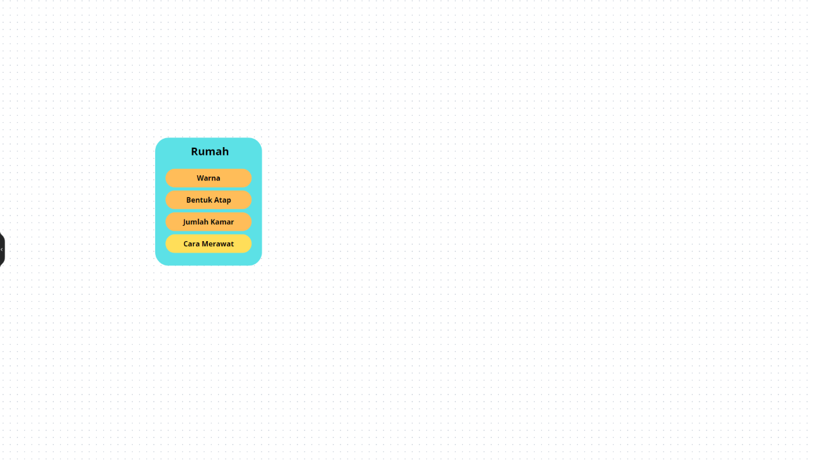
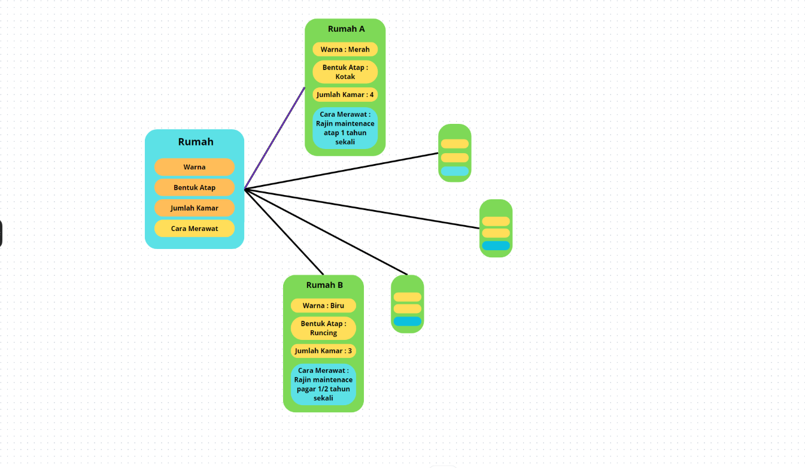
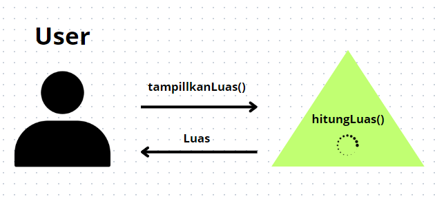
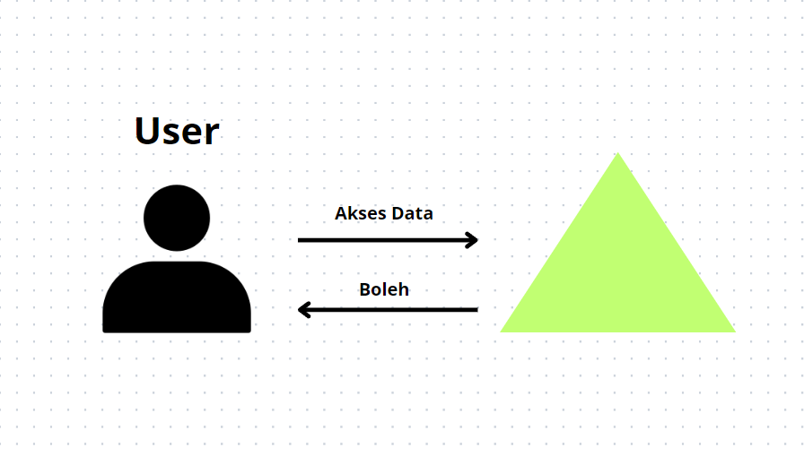
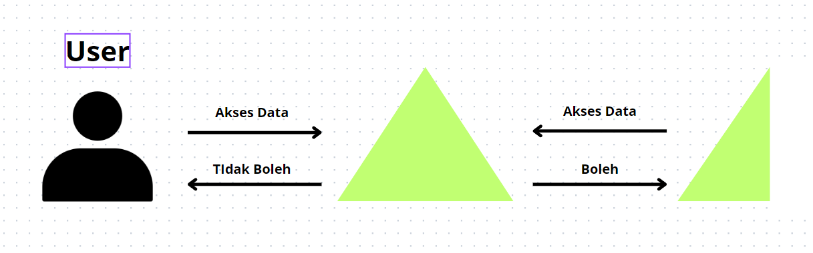
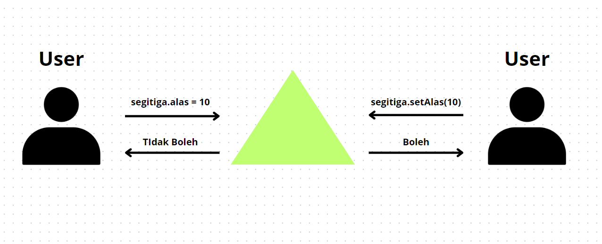

# **PBO A Tugas Week 2**

**Nama :** Adyuta Prajahita Murdianto

**NRP :** 5025221186

**Kelas :** PBO A

## Konsep Obyek

### **Class**

Class adalah blueprint atau cetak biru yang menggambarkan atribut dan perilaku (method) apa saja dari suatu object yang akan dibuat. Misal kita adalah seorang perancang sebuah perumahan, yang dimana setiap rumah pasti memiliki atribut (Warna, Bentuk atap, Jumlah kamar, dll) dan perilaku (Cara merawat, dll). Nah otomatis kita akan membuat sebuah rancangan atau cetak biru sebagai acuan kita membuat masing-masing rumah. Rancangan/Cetak biru itu lah yang dapat kita sebut sebagai Class.



```java
public class Rumah {
    // Atribut
    String warna;
    String bentukAtap;
    int jumlahKamar;

    // Perilaku(method): cara merawat rumah
    void caraMerawat(String caraMerawat) {
        System.out.println("Cara merawat rumah:");
        System.out.println(caraMerawat);
    }
}
```

### **Object**

Object adalah instance atau realisasi dari suatu Class. Kita ambil dari contoh kasus cetak biru rumah yang tadi. Misal pada perumahan kita dibangun rumah a, rumah b, dan rumah lain dengan atribut dan method yang beragam. Nah, rumah-rumah tersebutlah yang dapat kita sebut sebagai Object.



```java
public class Main {
    public static void main(String[] args) {
        // Rumah A
        Rumah rumahA = new Rumah() // Membuat object baru dari Class Rumah menggunakna `new`;
        rumahA.warna = "Merah";
        rumahA.bentukAtap = "Kotak";
        rumahA.jumlahKamar = 4;
        // Menampilkan cara merawat rumah A
        rumahA.caraMerawat("Rajin maintenance atap 1 tahun sekali");

        // Rumah B
        Rumah rumahB = new Rumah();
        rumahB.warna = "Biru";
        rumahB.bentukAtap = "Runcing";
        rumahB.jumlahKamar = 3;
        // Menampilkan cara merawat rumah B
        rumahB.caraMerawat("Rajin maintenance pagar 1/2 tahun sekali");

        
    }
}
```

### **Abstraction**

Abtraction atau abstraksi adalah suatu konsep dimana kita akan menyembunyikan implemmentasi yang tidak penting bagi pengguna dan hanya menunjukkan fungsionalitas yang penting saja bagi pengguna. Hal ini bertujuan agar pengguna hanya perlu tahu apa yang bisa dilakukan suatu Object tanpa perlu tahu bagaimana kompleksitas yang dilakukan oleh Object tersebut. Sebagai contoh, ada suatu object segitiga yang memiliki fungsi `tampilkanLuas`. Pengguna hanya perlu menggunakan fungsi tersebut, tanpa tahu bagaimana cara mendapatkan luas dari segitiga tersebut.



```java
// Segitiga.java
public class Segitiga {
  int alas;
  int tinggi;

  double hitungLuas() {
    return (alas * tinggi) / 2;
  }
  
  void tampilkanLuas() {
    System.out.println("Luas: " + hitungLuas());
  }
}

// Main.java
public class Main {
  public static void main(String[] args) {
    Segitiga segitiga = new Segitiga();
    segitiga.alas = 10;
    segitiga.tinggi = 5;
    segitiga.tampilkanLuas();// Menampilkan hasil perhitungan luas segitiga (25)        
  }
}
```

### **Encapsulation**

Encapsulation atau enkapsulasi adalah konsep pengamanan atribut dan perilaku (method) yang ada pada Class. Terdapat 3 jenis encapsulation, yakni `Public`, `Protected` dan `Private`.

**Public**

Public merupakan tingkat keamanan yang paling ringan pada Class. Setiap atribut dan perilaku (method) yang diberi tingkat keamanan ini, dapat diakses diluar Class dan juga dapat diakses dari turunan dari Class tersebut. Sebagai contoh, mari kita lihat dari studi kasus Class Segitiga,  



```java
// Segitiga.java
public class Segitiga {
  public int alas;
  public int tinggi;

  public double hitungLuas() {
    return (alas * tinggi) / 2;
  }
  
  public void tampilkanLuas() {
    System.out.println("Luas: " + hitungLuas());
  }
}

// Main.java
public class Main {
  public static void main(String[] args) {
    Segitiga segitiga = new Segitiga();
    segitiga.alas = 10;
    segitiga.tinggi = 5;
    segitiga.tampilkanLuas();// Menampilkan hasil perhitungan luas segitiga (25)        
  }
}
```

**Protected**

Protected adalah tingkat keamanan yang berada di tengah-tengah antara Public dan Private. Tingkat keamanan ini memperbolehkan atribut dan perilaku (method) dari suatu Class bisa diakses hanya dari turunan Class tersebut. 



```java
// Segitiga.java
public class Segitiga {
  protected String bentuk = "Segitiga";
  protected int hitungLuas (int alas, int tinggi){
    return (alas * tinggi) / 2;
  }
}

// SegitigaSiku.java
public class SegitigaSiku extends Segitiga {
  public int alas;
  public int tinggi;
  
  public void tampilkanJenis(){
    System.out.println("Jenis: " + bentuk + " Siku");
  }

  public void tampilkanLuas() {
    System.out.println("Luas: " + hitungLuas(alas, tinggi));
  }
}

// Main.java
public class Main {
  public static void main(String[] args) {
    SegitigaSiku segitigasiku = new SegitigaSiku();
    segitigasiku.alas = 10;
    segitigasiku.tinggi = 5;
    segitigasiku.tampilkanLuas(); // Menampilkan hasil perhitungan luas segitiga (25)        
    segitigasiku.tampilkanJenis(); // Menampilkan hasil Jenis      
    segitigasiku.jenis = "Kotak" // Tidak bisa/Error
    System.out.println(hitungLuas(segitigasiku.alas, segitigasiku.tinggi)) // Tidak bisa/Error 
  }
}
```

**Private**

Private adalah tingkat keamanan paling tinggi. Tingkat keamanan ini hanya memperbolehkan atribut dan perilaku (method) dari suatu Class, hanya bisa diakses dari Class itu saja. Khusus untuk atribut, agar kita bisa set nilai dan mendapatkan nilainya, kita harus membuat fungsi `getter` (mendapatkan nilai atribut class dari luar class) dan `setter` (set nilai atribut dari luar class) yang akan di set menjadi public.



```java
// Segitiga.java
public class Segitiga {
  private int alas;
  private int tinggi;

  private double hitungLuas() {
    return (alas * tinggi) / 2;
  }
  
  public void tampilkanLuas() {
    System.out.println("Luas: " + hitungLuas());
  }
  
  // Getter untuk alas
  public int getAlas() {
    return alas;
  }

  // Setter untuk alas
  public void setAlas(int alas) {
    this.alas = alas;
  }

  // Getter untuk tinggi
  public int getTinggi() {
    return tinggi;
  }

  // Setter untuk tinggi
  public void setTinggi(int tinggi) {
    this.tinggi = tinggi;
  }
}

// Main.java
public class Main {
  public static void main(String[] args) {
    Segitiga segitiga = new Segitiga();
    segitiga.setAlas(10);
    segitiga.setTinggi(5);
    System.out.println("Alas: " + segitiga.getAlas());
    System.out.println("Tinggi: " + segitiga.getTinggi());
    segitiga.tampilkanLuas();// Menampilkan hasil perhitungan luas segitiga (25)   
    segitiga.alas = 10; // Tidak boleh/Error     
    segitiga.tinggi = 5; // Tidak boleh/Error
    System.out.println("Alas: " + segitiga.alas); // Tidak boleh/Error
    System.out.println("Tinggi: " + segitiga.tinggi); // Tidak boleh/Error    
  }
}
```

Catatan : 

`this` merupakan keyword yang digunakan untuk merujuk ke atribut dari Object atau Instance saat ini. Kita ambil contoh dari kode berikut,

```java
public void setAlas(int alas) {
    this.alas = alas;
}
```

`this.alas` disini mengacu pada atribut alas dari Object yang sedang dieksekusi, dan `alas` yang tidak menggunakan `this` merupakan variable `alas` dari parameter fungsi. Alur dari kode atas sendiri adalah kita akan set nilai variable `alas` dari Object (`this.alas`) dengan nilai dari variable `alas` yang dikirimkan kedalam parameter fungsi. 

Selain menggunakan setter, kita juga bisa memanfaatkan perilaku (method) konstruktor untuk set nilai dari atribut yang bersifat `Private`. Konstruktor sendiri ialah perilaku (method) yang wajib atau otomatis terpanggil saat suatu Object atau Instance dibuat. Konstruktor bisa diberi parameter dan juga bisa tidak. Untuk mengirim argument ke fungsi konstruktor, kita bisa memberi argument saat kita menginisiasi object baru.

```java
// Segitiga.java
public class Segitiga {
  private int alas;
  private int tinggi;

  // Konstruktor untuk set alas dan tinggi
  public Segitiga(int alas, int tinggi) {
    this.alas = alas;
    this.tinggi = tinggi;
    System.out.println("Ini Konstruktor untuk set alas dan tinggi");
  }

  private double hitungLuas() {
    return (alas * tinggi) / 2;
  }
  
  public void tampilkanLuas() {
    System.out.println("Luas: " + hitungLuas());
  }
  
  // Getter untuk alas
  public int getAlas() {
    return alas;
  }

  // Setter untuk alas
  public void setAlas(int alas) {
    this.alas = alas;
  }

  // Getter untuk tinggi
  public int getTinggi() {
    return tinggi;
  }

  // Setter untuk tinggi
  public void setTinggi(int tinggi) {
    this.tinggi = tinggi;
  }
}

// Main.java
public class Main {
  public static void main(String[] args) {
    Segitiga segitiga = new Segitiga(10, 5);   
    System.out.println("Alas: " + segitiga.getAlas());
    System.out.println("Tinggi: " + segitiga.getTinggi());
    segitiga.tampilkanLuas();
  }
}
```
